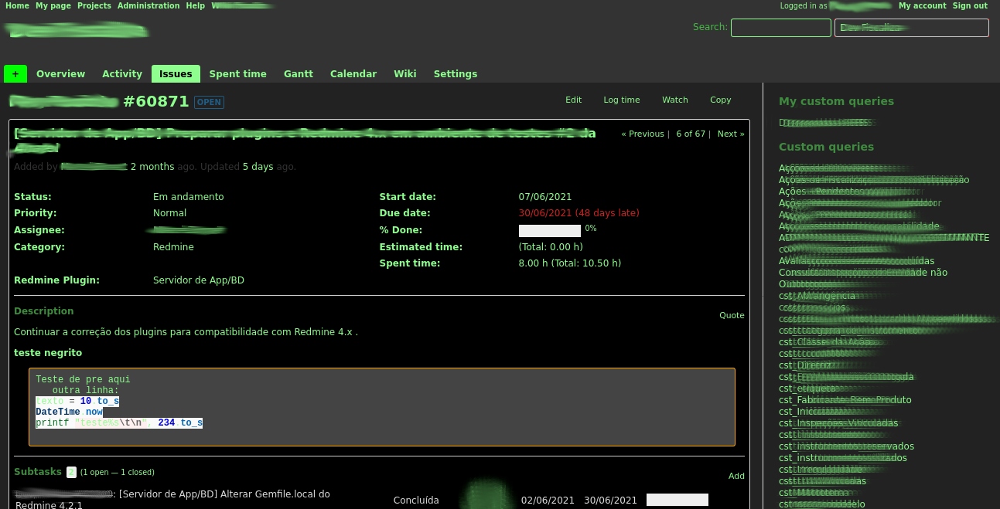

# redmine_theme-terminal

Work In Progress.

Dark theme for Redmine 4.

# Theme

3 base color layout: green, orange and black.

## Text:

Green: #8EFF8E

Dark green: 3F8B3F

Highlights or active/hover links: orange

## Background

Body background-color: #333

Forms and other "hilighted" background: #222

## Notes:

Redmine default blue is: #628DB6. Most of them changed to green.

most #f8f8f8 changed to #48BE48
